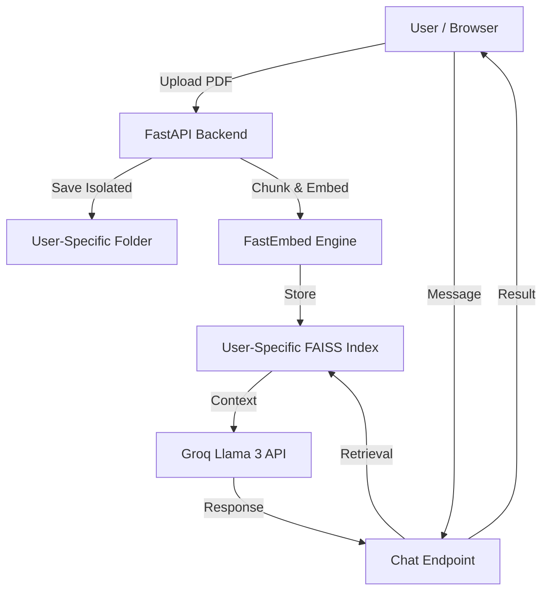

# Project Architecture Overview

## 1. System Stack

| Layer          | Technology Used                                 | Role / Purpose                                      |
| -------------- | ----------------------------------------------- | --------------------------------------------------- |
| **Frontend**   | React.js + Tailwind CSS                         | Responsive UI, Chat Interface, 3D Landing Page      |
| **Backend**    | FastAPI (Python)                                | Asynchronous REST API, RAG orchestration            |
| **AI Model**   | Groq Llama 3.1 8B                               | Instant cloud-based chat inference (0 RAM usage)    |
| **Embeddings** | FastEmbed (all-MiniLM-L6-v2)                    | Lightweight ONNX-based vector generation (~90MB)    |
| **RAG Engine** | LlamaIndex                                      | Document chunking, retrieval, and context management |
| **Vector Store**| FAISS (In-Memory)                              | High-speed local similarity search                  |
| **Database**   | Supabase (PostgreSQL)                           | User Auth, Chat History, Session Management         |
| **Hosting**    | Render (Free Tier)                              | Managed web service with 512MB RAM restriction      |

---

## 2. Backend API Endpoints

| Method | Endpoint | Auth Required | Purpose |
| ------ | -------- | ------------- | ------- |
| **GET** | `/` | No | API heartbeat and root status check. |
| **GET** | `/health` | No | Deep health check for deployment monitoring. |
| **POST** | `/upload` | Yes | Uploads documents and triggers isolated RAG indexing. |
| **POST** | `/chat` | Yes | Primary AI chat endpoint for document querying. |
| **GET** | `/chat/sessions/{id}` | Yes | Retrieves list of past chat sessions for a user. |
| **GET** | `/chat/messages/{id}` | Yes | Fetches full message history for a specific session. |
| **DELETE** | `/chat/session/{id}` | Yes | Securely wipes a chat session and its messages. |
| **GET** | `/user/me` | Yes | Retrieves the profile of the currently authenticated user. |

---

## 3. Environment Variables (.env)

| Variable | Purpose | Description |
| -------- | ------- | ----------- |
| `GROQ_API_KEY` | AI Inference | Authenticates the backend with Groq for Llama 3 reasoning. |
| `SUPABASE_URL` | Cloud DB | The API URL for your hosted Supabase PostgreSQL project. |
| `SUPABASE_KEY` | Public Auth | Used by the client to interact with Supabase authentication. |
| `SUPABASE_SERVICE_ROLE_KEY` | Admin DB | Used for high-privilege backend operations (like deleting sessions). |

---

## 4. High-Level System Flow

---

## 5. Core Backend Components

| Component              | Responsibility                                                                 |
| ---------------------- | ------------------------------------------------------------------------------ |
| **Upload Manager**     | Validates and saves files to isolated directories: `app/data/uploads/{user_id}` |
| **Indexing Service**   | Streams documents, chunks text, and generates a private FAISS index per user.   |
| **Chat Orchestrator**  | Retrieves history from Supabase and coordinates context retrieval with FAISS.   |
| **Memory Guardian**    | Enforces `threads=1` and manual garbage collection to keep RAM under 512MB.     |

---

## 6. Authentication & Security

| Feature                | Implementation                                                                |
| ---------------------- | ----------------------------------------------------------------------------- |
| **OAuth 2.0**          | Secure login via Google & GitHub through Supabase Auth providers.             |
| **2FA (MFA)**          | App-based OTP verification using Supabase multi-factor infrastructure.         |
| **OAuth Passwordless** | Custom backend logic bypasses password checks for social login users.         |
| **Secure Deletion**    | Account deletion triggers cascading cleanup of all user-specific AI files.    |

---

## 7. Extreme Memory Optimizations

| Optimization           | Technology / Logic                                                            | Impact                                      |
| ---------------------- | ----------------------------------------------------------------------------- | ------------------------------------------- |
| **Engine Swap**        | Replaced PyTorch with FastEmbed (ONNX)                                        | Reduced idle RAM by 400MB+                  |
| **Model Scaling**      | Used `all-MiniLM-L6-v2` (~90MB)                                               | Smallest model with high parsing accuracy   |
| **Thread Control**     | Set `threads=1` for AI inference                                              | Prevented CPU/RAM spikes and timeouts       |
| **Cloud Offloading**   | Used Groq API for LLM reasoning                                               | Saved ~4GB of RAM (size of a local Llama 3) |
| **Build Optimization** | `download_model.py` pre-downloads AI during build                              | Eliminated cold-start indexing failures     |

---

## 8. Detailed RAG Workflow

The core intelligence of DocuMind AI follows a strict 2-phase pipeline to ensure fast retrieval while keeping memory usage extremely low.

### Phase A: Document Ingestion 
This occurs when a user uploads a PDF.

| Step | Action | Logic / Optimization |
| ---- | ------ | -------------------- |
| **1** | **File Isolation** | File is saved in `app/data/uploads/{user_id}/` to ensure private indexing. |
| **2** | **Chunking** | The PDF is broken into small, overlapping text blocks (512 characters each). |
| **3** | **Embedding** | Each block is sent to the **MiniLM model**. It turns text into a vector (list of numbers). |
| **4** | **Indexing** | Vectors are stored in a **FAISS Index** created specifically for that user in the server's RAM. |

### Phase B: The Chatting Phase
This occurs when a user asks a question.

| Step | Action | Logic / Optimization |
| ---- | ------ | -------------------- |
| **1** | **Question Embedding** | The user's question is also translated into a vector using the same MiniLM model. |
| **2** | **Similarity Search** | The system searches the user's private FAISS index for the top 5 most relevant text chunks. |
| **3** | **Context Assembly** | The found chunks are packaged into a "Context Block" alongside the user's question. |
| **4** | **LLM Synthesis** | The question + context is sent to **Groq (Llama 3)**. The AI answers *only* using the provided data. |
| **5** | **Storage** | Both the question and AI answer are saved to the Supabase `chat_messages` table. |

---

## 9. Multi-User Isolation Strategy

| Isolation Layer | Implementation Detail                                                                 |
| --------------- | ------------------------------------------------------------------------------------- |
| **File System** | Every user has a unique physical directory on the disk based on their Supabase UID.   |
| **AI Brain**    | The server maintains a dictionary of FAISS indices. User A cannot query User B's index. |
| **Context**     | Retrieval is strictly restricted to the logged-in `user_id` during every chat turn.    |