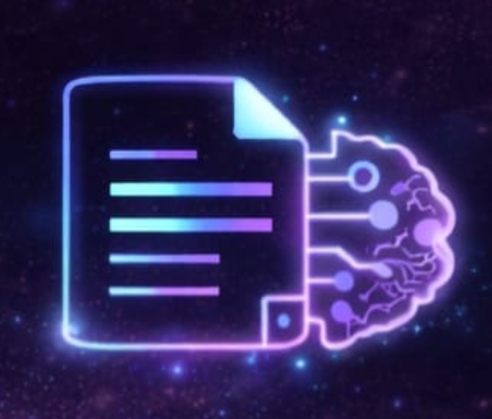
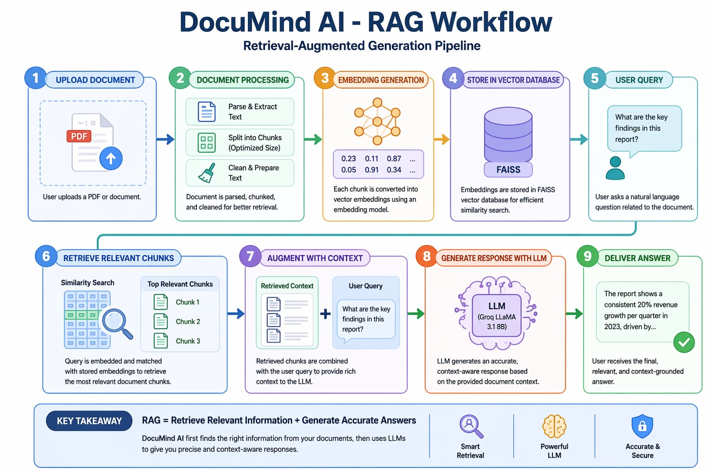

  

## Overview

DocuMind AI is an advanced document-based conversational platform that enables users to upload files such as PDFs and interact with them using natural language queries. Built using Retrieval-Augmented Generation (RAG) and large language models, the system delivers accurate, context-aware responses derived directly from user-provided documents. The platform is designed to simplify information retrieval, enhance productivity, and provide a secure, intelligent interface for working with large volumes of unstructured data.

---

## 🎥 Demo

https://github.com/user-attachments/assets/b2df5338-e514-42ab-870c-91419b50320d

---

## 🎥 Full Project Walkthrough (Loom)

Here is a full explanation of the project demonstrating features and workflow.

  <a href="https://www.loom.com/share/1a8af684822a43e9b4b2518c406addc6">
    ▶️ Watch Full Project Walkthrough
  </a>

---

---

## 🛠️ System Architecture & Workflow

Below is the visual overview of how **DocuMind AI** processes documents, manages retrieval, and generates intelligent responses through its RAG pipeline.

  

---

## Tech Stack

| Layer        | Technology Used                                 |
| ------------ | ----------------------------------------------- |
| Frontend     | React.js, Tailwind CSS                          |
| Backend      | FastAPI (Python)                                |
| AI Model     | Groq LLaMA 3.1 8B Instant                       |
| RAG Engine   | LlamaIndex                                      |
| Vector Store | FAISS                                           |
| Database     | Supabase                                        |
| Auth         | Supabase Auth (Email, Google, GitHub, 2FA)      |
| Security     | OTP-based 2FA, Password Reset, Account Deletion |