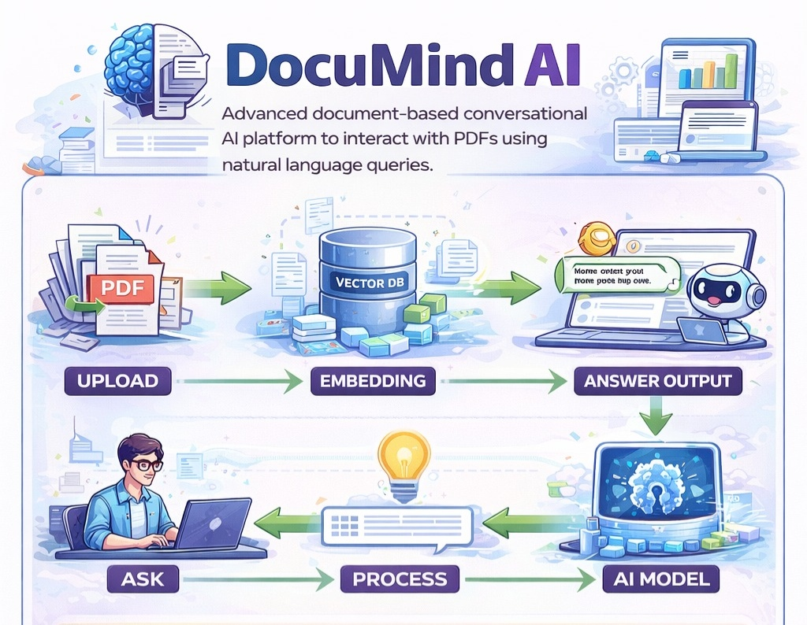

  

## Overview

DocuMind AI is an advanced document-based conversational platform that enables users to upload files such as PDFs and interact with them using natural language queries. Built using Retrieval-Augmented Generation (RAG) and large language models, the system delivers accurate, context-aware responses derived directly from user-provided documents. The platform is designed to simplify information retrieval, enhance productivity, and provide a secure, intelligent interface for working with large volumes of unstructured data.

---

## 🎥 Demo

https://github.com/user-attachments/assets/b2df5338-e514-42ab-870c-91419b50320d

---

## 🎥 Full Project Walkthrough (Loom)

Here is a full explanation of the project demonstrating features and workflow.

  <a href="https://www.loom.com/share/1a8af684822a43e9b4b2518c406addc6">
    ▶️ Watch Full Project Walkthrough
  </a>

---

## Key Features

### Document Intelligence

* Upload and process large PDF documents efficiently  
* Handles large-scale documents with optimized chunking  
* Context-aware question answering using RAG architecture  
* High-relevance retrieval with improved semantic search  

### Interactive Chat System

* Real-time conversational interface  
* Accurate responses grounded in document context  
* Enhanced retrieval using optimized similarity search  

### File Handling

* Drag-and-drop file upload support  
* Seamless document ingestion pipeline  
* Automatic indexing and processing  

---

## Security Features

DocuMind AI is built with strong user security and account management capabilities:

* Two-Factor Authentication (2FA) using 6-digit OTP (Authenticator-based)  
* Email-based password reset (Forgot Password)  
* Secure account deletion via backend API  
* Protected routes for authenticated users only  
* Session-based authentication using Supabase  
* OAuth login support (Google and GitHub)  

---

## How to Use

1. **Create an Account / Login**  
   Sign up using email or log in via Google/GitHub authentication.  

2. **Upload Document**  
   Upload a PDF file using file selection or drag-and-drop.  

3. **Ask Questions**  
   Enter queries related to the uploaded document.  

4. **Receive Responses**  
   The system retrieves relevant content and generates accurate answers.  

5. **Enhanced Security (Optional)**  
   Enable 2FA for additional account protection.  

6. **Manage Account Settings**  
   Update email, password, or delete account securely.  

---

## Technical Architecture

DocuMind AI follows a modular full-stack architecture:

* Frontend handles UI/UX and user interaction  
* Backend manages APIs, document processing, and business logic  
* AI layer performs embedding, retrieval, and response generation  
* Authentication and database services are managed via Supabase  

---

## Tech Stack

| Layer        | Technology Used                                 |
| ------------ | ----------------------------------------------- |
| Frontend     | React.js, Tailwind CSS                          |
| Backend      | FastAPI (Python)                                |
| AI Model     | Groq LLaMA 3.1 8B Instant                       |
| RAG Engine   | LlamaIndex                                      |
| Vector Store | FAISS                                           |
| Database     | Supabase                                        |
| Auth         | Supabase Auth (Email, Google, GitHub, 2FA)      |
| Security     | OTP-based 2FA, Password Reset, Account Deletion |
